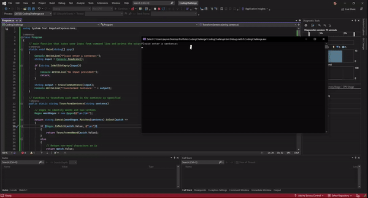
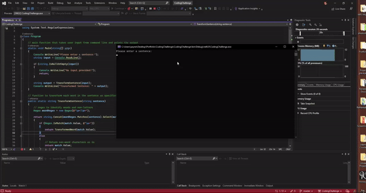

# CoxCodingChallenge

**Challenge Description**:

In the programming language of your choice, write a program that parses a sentence and replaces each word with the following: first letter, number of distinct characters between first and last character, and last letter.

Words are separated by spaces or non-alphabetic characters and these separators should be maintained in their original form and location in the answer.

**Example**:

- **Input 1**: It was many and many a year ago
- **Output 1**: I0t w1s m2y a1d m2y a y2r a1o
- **Input 2**: Copyright,Microsoft:Corporation
- **Output 2**: C7t,M6t:C6n

**User interface expectations**:

- **Input**: Command Line Interface: One should be able to pass the argument (input) on command line
- **Output**: Should print the output on command line

**Rules**:

- Code variables must be in English.
- Use the main function arguments.
- The function should not be static nor main.
- The function should not use hardcoded values.
- The function must be reusable.
- Include test cases.
- Document your code.
- Provide the file(s) in .zip format or provide a link to a repository interviewers can access.
- Be prepared to have your code running so you can present it and discuss it during the interview.

**Evaluation Criteria**:

A few of the things we will be looking at is accuracy, efficiency, solution completeness, hygiene, etc.

Do include the results of your test run with your test data, along with the source-code in your
solution.

**Test Cases**

User provides the input: "It was many and many a year ago":

User provides the input: "Copyright,Microsoft:Corporation":

User does not provide an input:

